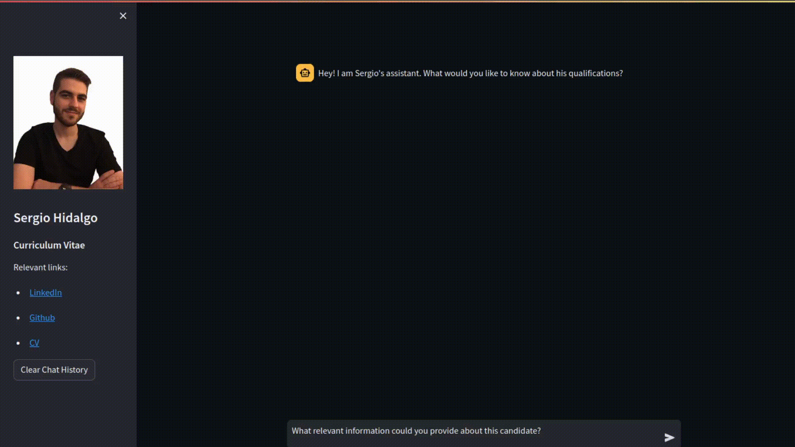
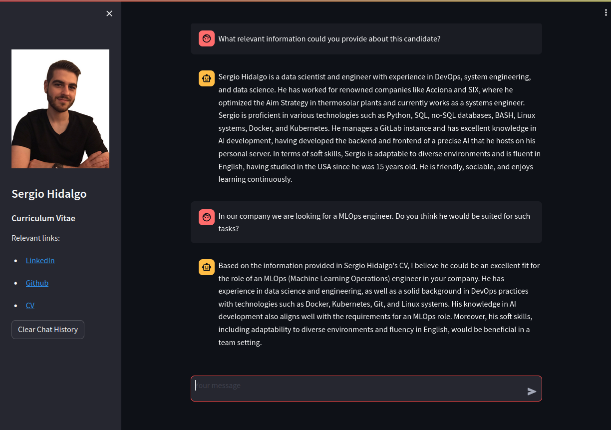

# Interactive Resume with Streamlit and Ollama



## Overview

This project aims to create an interactive resume using Streamlit, a Python library for building web applications, and Ollama, a language model for conversational AI. The interactive resume allows users to engage in a conversation with an AI assistant to learn more about a person's qualifications, experience, and other relevant information typically found in a resume.

## Features

- **Streamlit Interface:** Utilizes Streamlit to create a user-friendly interface for interaction.
- **Ollama Integration:** Incorporates Ollama, a language model, to generate conversational responses.
- **Chat-Based Interaction:** Enables users to ask questions and receive responses in a conversational format.
- **Clear and Informative:** Provides relevant links and information about the person whose resume is being presented.

## Installation 
### Docker
#### Requirements:
1. Bash to set up variables
2. Python for setup script
3. Docker ;)
#### Instructions:
```
git clone https://github.com/serghidalg/interactive-resume && cd interactive-resume && python setup_variables.py
```
#### Run it:
##### With docker:
```
docker build -t interactive-resume .
docker run -d -p 8501:8501 interactive-resume
```


### Linux
#### Requirements:
1. Python library accessible from terminal
2. Python venv
3. Python pip

#### Instructions:
```
git clone https://github.com/serghidalg/interactive-resume && cd interactive-resume && bash install.sh
```
#### Run it:
```
source venv/bin/activate
streamlit run main.py
```
#### Web access
Now everything should be accessible from 0.0.0.0:8501 on your web browser :D

*Note:* There is a streamlit_cv.service file which can be useful to some people in the files folder.

## Usage

- Upon launching the application, you'll see a sidebar with relevant links and the conversation area.
- Users can input questions or prompts in the chat input area.
- The AI assistant (powered by Ollama) will respond to user queries, creating an interactive conversation.

## Customization Guide:
Please note that certain sections of this project might need customization to suit individual preferences or information. Here are the sections you might want to review and potentially modify:
1. **Install Ollama server:** This project relies on you having a working ollama server working.

2. *ollama_handler.py*: Points to a specific IP for your Ollama server and model name. A second IP can be set as fallback. It also sets some rules for the assistant to follow.

3. *session_logic.py*: Contains specific information about the first prompt that the streamlit will show.

4. *ui.py*: Holds my personal info so the interviewers can know more about my work.


